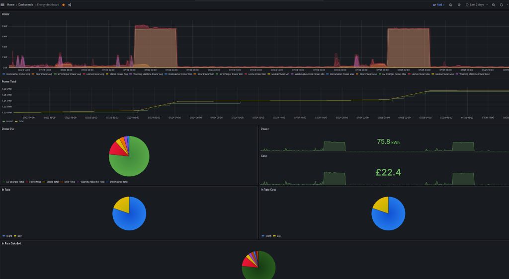

Intro
=====

This is just my hacky home energy Grafana setup built on Home Assistant.

Quick write up
==============

It's not big or clever, but it might save someone time looking at this.

So all I've done is set Home Assistant to use MySQL.
Then I've added two extra tables in the database.

One for linking the metadata to a decent name (because HA uses a mix of DB and YAML) to display with Grafana.

The other is for day/night rates costing.

The first table is just:

    create table joe_name_links
    (
     name varchar(32),
     metadata_id int,
     scale double
    );

You add to it with say:

    insert into joe_name_links (name, metadata_id, scale) VALUES('Home Power', 71, 1000);
    insert into joe_name_links (name, metadata_id, scale) VALUES('EV Charger Power', 34, 1);
    insert into joe_name_links (name, metadata_id, scale) VALUES('Media Power', 22, 1);
    insert into joe_name_links (name, metadata_id, scale) VALUES('Drier Power', 3, 1);
    insert into joe_name_links (name, metadata_id, scale) VALUES('Internet Power', 14, 1);

    insert into joe_name_links (name, metadata_id, scale) VALUES('Home Total', 71, 1000);
    insert into joe_name_links (name, metadata_id, scale) VALUES('EV Charger Total', 34, 1);
    insert into joe_name_links (name, metadata_id, scale) VALUES('Media Total', 22, 1);
    insert into joe_name_links (name, metadata_id, scale) VALUES('Drier Total', 3, 1);
    insert into joe_name_links (name, metadata_id, scale) VALUES('Internet Total', 14, 1);

"Power" postfix is used and expected for kw, or in the case of home here, thus the different scale, watt.
"Total" postfix is used and expected for kwh, or in the case of home here, thus the different scale, wh.
"Home" is an expected name for the house total.
You're see all three of those used in the SQL of the Grafana queries.

The second is complicated:

    create table joe_rate_links
    (
     id INT NOT NULL AUTO_INCREMENT,
     name varchar(32) NOT NULL,
     rate float NOT NULL,
     start_time TIME NOT NULL,
     end_time TIME NOT NULL,
     valid_from_ts BIGINT NOT NULL,
     valid_to_ts BIGINT,
     PRIMARY KEY (id)
    );

Basically the rate has a name, a time of day start and end, then valid to / from time stamps. This way you can support changing tarrif. 

So supposing you changed tarrif on 2023-07-12, and wanted the both in you DB so you could see the changing.

First you insert the old tarrif from UNIX origin (0) to the switch over date.

    insert into joe_rate_links (name, rate, start_time, end_time, valid_from_ts, valid_to_ts) VALUES("Day", 0.43, '00:00:00', '00:29:59', 0, UNIX_TIMESTAMP(date('2023-07-12')));
    insert into joe_rate_links (name, rate, start_time, end_time, valid_from_ts, valid_to_ts) VALUES("Night", 0.40, '00:30:00', '03:59:59', 0, UNIX_TIMESTAMP(date('2023-07-12')));
    insert into joe_rate_links (name, rate, start_time, end_time, valid_from_ts, valid_to_ts) VALUES("Day", 0.43, '04:00:00', '23:59:59', 0, UNIX_TIMESTAMP(date('2023-07-12')));

Second you'd insert the new tarrif from the switch over data to some distant date UNIX timestamp.

    insert into joe_rate_links (name, rate, start_time, end_time, valid_from_ts, valid_to_ts) VALUES("Day", 0.2961,'00:00:00','00:30:00', UNIX_TIMESTAMP(date('2023-07-12'), 32521103452);
    insert into joe_rate_links (name, rate, start_time, end_time, valid_from_ts, valid_to_ts) VALUES("Night", 0.2961, '00:30:00', '04:00:00', UNIX_TIMESTAMP(date('2023-07-12'), 32521103452);
    insert into joe_rate_links (name, rate, start_time, end_time, valid_from_ts, valid_to_ts) VALUES("Day", 0.2961, '04:00:00', '23:59:59', UNIX_TIMESTAMP(date('2023-07-12'), 32521103452);

